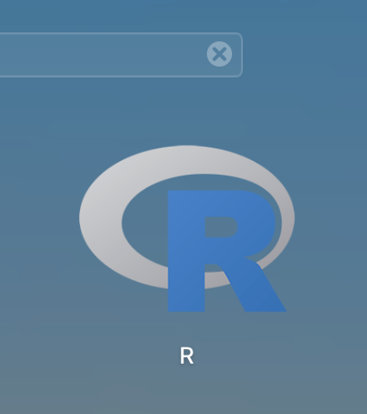

# **Rstudio Cloud** 

Please follow the steps outlined below to get set up on **RStudioCloud**.

We are using RStudioCloud because:

* It allows us to access your workspace and help debug any issues.
* Provides a single environment where you can complete the final coursework.
* No need to install R or RStudio on your own computer—everything runs in the cloud.
* Ensures everyone has the same software versions and packages, reducing compatibility problems.
* Your work is automatically saved and backed up online.
* You can access your projects from any device with an internet connection.
* Makes collaboration and sharing code with instructors and classmates easier.

### **Step 1: Find RStudioCloud**

Please visit the RStudioCloud workspace (Posit Cloud) by [CLICKING THIS LINK](https://posit.cloud/spaces/705624/join?access_code=FAZdF6dqWYc64tXzwCmTMHC3EZOQ4gWyeDHCac4N). 

This will redirect you to a page which looks like that below: 

----------------------------------

### **Step 2: Register for a new account.** 

If you have not already registered, please sign up for a new account. **Make sure to use your QMUL email address** 

----------------------------------

### **Step 3: Access your workspace.** 

Once logged in, select to join the **BIO773P-2025** workspace as shown on the left-hand side. 

----------------------------------

<strong>Perfect! You are now all set to go!  
Please only complete the section below if you would like to have R installed on a local device to practice offline.</strong>

----------------------------------

# **OPTIONAL: Local Installation of R.** 

You may want to install R & RStudio on your local computer. This will give you somewhere to practice when you are "offline" (aka not connect to the internet). If you have your own laptop I would recommend doing this. 

---------------------

## **Step 1: Head to the The Comprehensive R Archive Network**

Head over to the [CRAN Homepage](https://cran.r-project.org/)

---------

##  **Step 2: Select your operating system (MacOS, Windows, Linux)** 

---------

# **Setp 3: Follow installation instructions for given operating system** 

For example for an apple silicon Mac I would select to install the package **R-4.5.1-arm64.pkg**

--------------

## **Step 4: Validate R Installation**

Following installation, search for **R** in your installed programs. Click on it and bring up the R console. 

## **Step 5: You can now install RStudio**

Please go to the website: [https://posit.co/downloads/](https://posit.co/downloads/) and follow the guided download process. Make sure to select the **FREE** option. 

